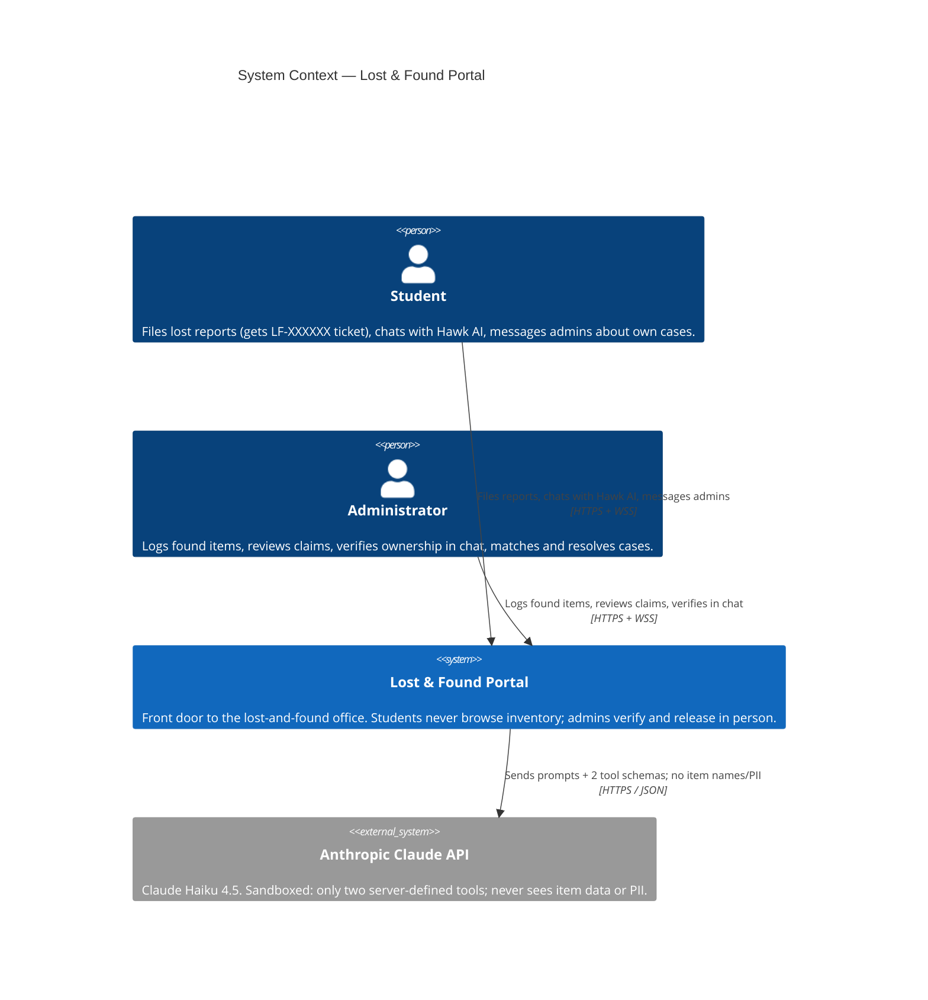
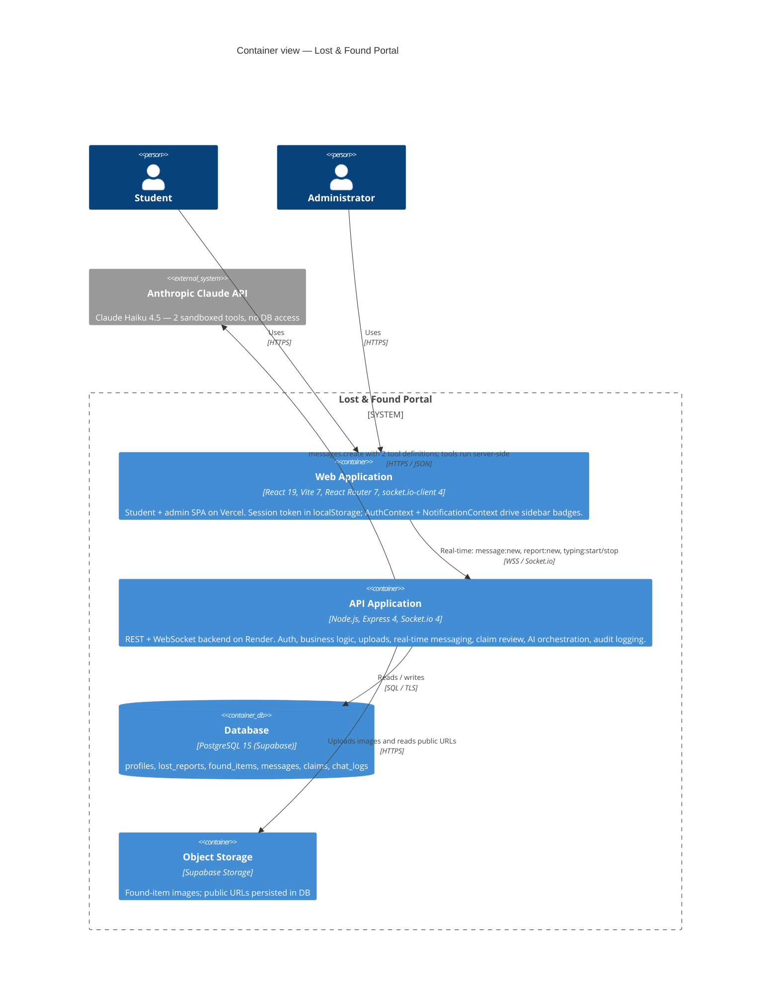
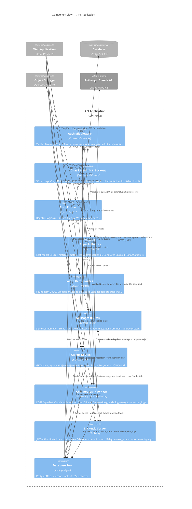

# Architecture diagrams

C4 model for the **Lost & Found Portal**. The authoritative source is
[`workspace.dsl`](workspace.dsl) (Structurizr DSL); the Mermaid diagrams below
mirror it so the views render directly on GitHub.

Three views:

- **C1 — System Context** — who uses the portal and what external systems it talks to.
- **C2 — Containers** — runtime pieces of the system (SPA, API, DB, object storage).
- **C3 — Components** — internal makeup of the API container.

To regenerate from the DSL, paste `workspace.dsl` into the online viewer at
<https://structurizr.com/dsl>, or run `structurizr-cli export -workspace workspace.dsl -format png`.

---

## C1 — System Context

---

## C2 — Containers

---

## C3 — Components (inside the API)

